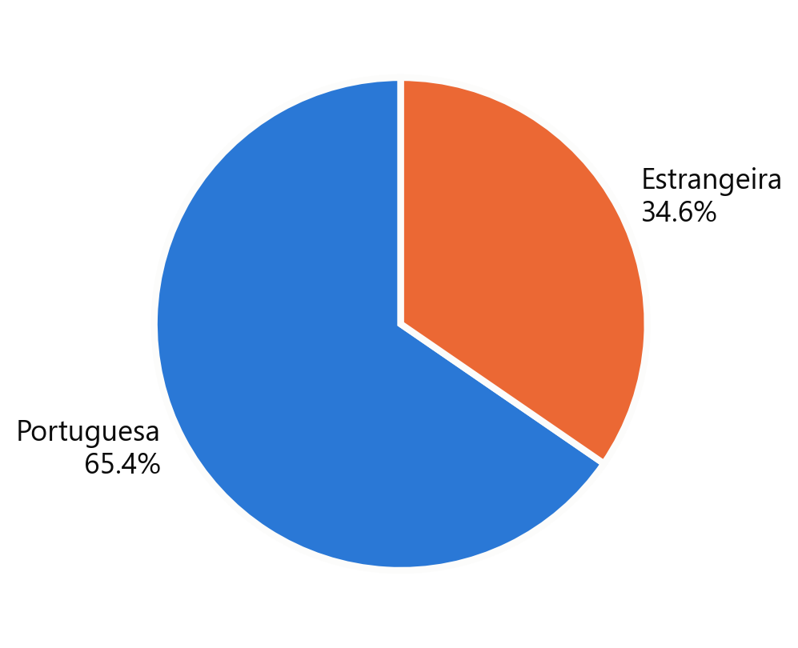
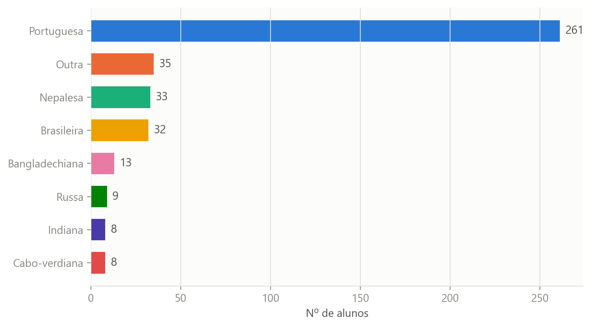
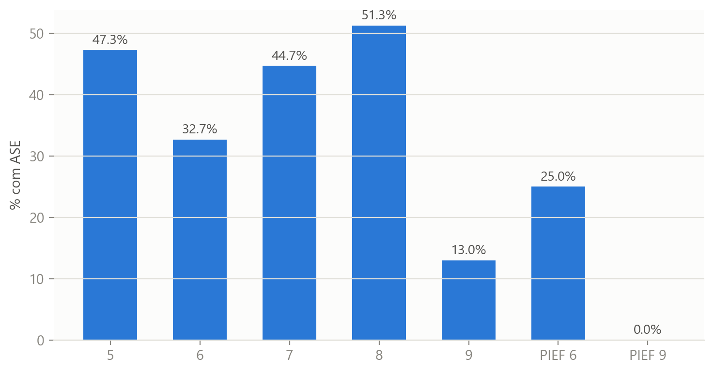

# Diversidade e Apoio Socioeducativo — Escola TEIP

**Project summary (English):** An end-to-end data analysis project built from real (fully
anonymized) student administrative data at a Portuguese public school under the **TEIP**
program (Priority Intervention Educational Territories — extra government support for
schools in socioeconomically vulnerable areas). Covers data cleaning, a privacy-first
anonymization pipeline, exploratory analysis, an interactive dashboard, and an executive
slide deck. Stack: Python, pandas, matplotlib/seaborn, Plotly, Streamlit, python-pptx.

---

## Contexto

Este projeto nasceu do trabalho de processamento de dados de alunos que fiz como estagiário
no **Agrupamento de Escolas Francisco de Arruda** (Ajuda, Lisboa) entre junho e agosto de
2026, atualizando registos no sistema **Inovar**.

O agrupamento é uma **escola TEIP** (Território Educativo de Intervenção Prioritária) — um
programa do Ministério da Educação, iniciado em 1996 e atualmente na sua 4ª geração (TEIP4,
desde 2024/25), que apoia escolas em contextos socioeconómicos mais vulneráveis, com recursos
e acompanhamento diferenciados, para combater o abandono escolar e garantir o sucesso
educativo de todos os alunos. Isto explica a grande diversidade do corpo estudantil e a
existência de turmas PIEF (Programa Integrado de Educação e Formação) refletidas nestes dados.

A partir desse trabalho, construí este projeto de análise de dados — para consolidar
competências técnicas e para apresentar um retrato quantitativo da escola à direção.

## ⚠️ Privacidade em primeiro lugar

Os dados de origem contêm informação pessoal de menores (nomes, documentos de identificação,
NIF, NISS, contactos de emergência, datas de nascimento). **Nenhum destes identificadores
diretos está neste repositório.** O pipeline em [`src/anonymize.py`](src/anonymize.py):

- Remove por completo documentos de identificação, NIF, NISS, Utente SNS e contactos de emergência.
- Substitui o nome do aluno por um ID sequencial pseudónimo (`ALU-0001`, ...).
- Converte data de nascimento em idade (sem o dia/mês exatos).
- Converte descrições de saúde/alimentares em texto livre em simples indicadores booleanos
  (nunca publica o diagnóstico).
- Agrupa nacionalidades muito raras (< 3 alunos na escola) para evitar identificação indireta.

Only `data/processed/alunos_anonimizado.csv` (o resultado final, anonimizado) é versionado.
O ficheiro real (`data/raw/`) e a tabela de correspondência ID↔nome nunca saem da máquina local
— ver [`.gitignore`](.gitignore).

## O que está aqui

| Pasta | Conteúdo |
|---|---|
| `src/anonymize.py` | Pipeline de anonimização (xlsx real → CSV anonimizado) |
| `src/analysis.py` | Funções de análise reutilizáveis (rácios, taxas, índices) |
| `src/style.py` | Paleta de cores e estilo partilhados por todos os gráficos |
| `notebooks/analysis.ipynb` | Análise exploratória completa, com gráficos |
| `dashboard/app.py` | Dashboard interativo (Streamlit) |
| `slides/` | Apresentação para a direção da escola (`apresentacao.pptx`) |
| `data/processed/` | Dataset anonimizado (o único dado versionado) |

## Principais resultados

- **463 alunos**, 23 turmas, 5º ao 9º ano + turmas PIEF.
- **~1 em cada 3** alunos com nacionalidade registada é de origem estrangeira (mais de 10
  nacionalidades representadas) — índice de diversidade de Simpson: **0.55**.
- A taxa de **Ação Social Escolar (ASE)** varia bastante por ano de escolaridade e é
  claramente mais baixa entre alunos estrangeiros.
- O acesso a **internet** em casa é consideravelmente mais comum do que o acesso a
  **computador** próprio.
- Vários campos (nacionalidade, data de nascimento) têm lacunas de preenchimento
  relevantes — uma oportunidade concreta de melhoria de processo no Inovar.

<p align="center">
  
  
  
</p>

## Como correr

```bash
pip install -r requirements.txt

# 1. (opcional) recriar o dataset anonimizado a partir do xlsx real em data/raw/
python src/anonymize.py

# 2. explorar a análise
jupyter notebook notebooks/analysis.ipynb

# 3. dashboard interativo
streamlit run dashboard/app.py
```

## Stack

Python · pandas · matplotlib / seaborn · Plotly · Streamlit · python-pptx

## Autor

Projeto realizado no âmbito do estágio no Agrupamento de Escolas Francisco de Arruda
(jun–ago 2026).
